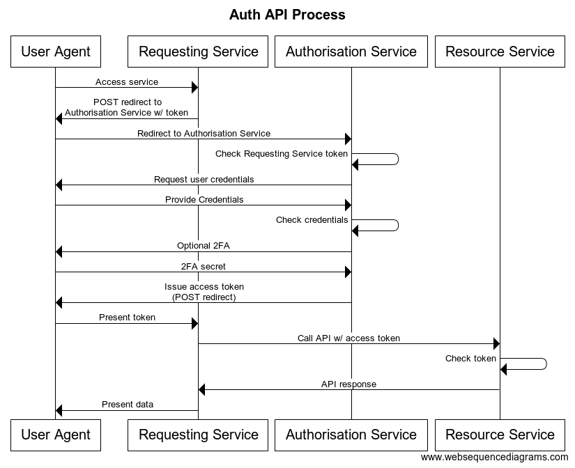

# Auth
## Summary
An authentication/authorisation suite for use in any enterprise grade application.

## Authentication/Authorisation Flow

## Dependencies
Python modules:
- cryptography
- Flask
- Flask-PyMongo
- PyCryptodome
- PyJWT
- PyMongo
- base64

## Setup
Create a public/private key pair using OpenSSL (entering a passphrase, in this example password123):

`openssl genrsa -des3 -out auth.pem 2048`

Export the public key:

`openssl rsa -in auth.pem -outform PEM -pubout -out auth_public.pem`
